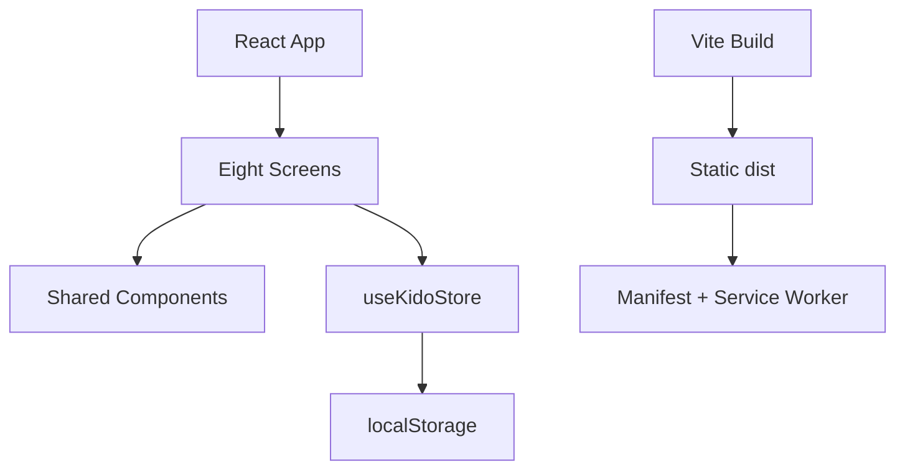

# KIDO Technical Architecture v0.1

**Status:** implementation baseline for the first interactive MVP prototype
**Product:** KIDO — *Small habits. Big kids.*
**Audience:** parent buyer and child user, initially ages 6–12
**Product loop:** Habits → Practice → Progress → Independence → Graduation

## 1. Architecture goals

- Deliver a mobile-first web experience that can be installed as a Progressive Web App.
- Support the agreed eight-screen journey with a small, understandable React codebase.
- Make the habit loop usable without a server in this prototype; retain state on the current device.
- Keep parent and child experiences distinct while sharing the same household and habit data.
- Keep future account sync, multiple caregivers, notifications, and analytics outside v0.1.

## 2. Stack

| Area | v0.1 choice | Responsibility |
| --- | --- | --- |
| UI | React 19 | Screen composition, interaction state, accessible controls |
| Build/dev server | Vite 6 | Local development and static production bundle |
| Language | JavaScript modules + JSX | Low setup cost for the first implementation |
| Styling | CSS custom properties + component classes | Design tokens, responsive layout, parent/kid visual modes |
| Persistence | `localStorage` | Single-device prototype persistence; key `kido-state-v1` |
| PWA | Web App Manifest + service worker | Install metadata and same-origin app-shell caching |
| Hosting | Static hosting compatible with Vite output | Serve `dist/` over HTTPS for PWA installation |

## 3. Runtime shape



`App.jsx` selects the active screen and owns the parent/kid mode switch. `useKidoStore` owns the household state and exposes focused actions for onboarding, requesting practice approval, approving a habit, adding a habit, and graduating one. Screens receive state and callbacks as props. Shared presentation pieces live in `src/components`; reusable vocabulary and starter data live in `src/data`.

## 4. Screen map

| # | Screen | Main responsibility |
| --- | --- | --- |
| 01 | Landing | Explain the KIDO promise and begin setup |
| 02 | Add Child | Capture name/nickname, age (6–12), and avatar |
| 03 | Choose Goals | Choose 1–3 focus areas |
| 04 | Starter Routine | Select a small starter set and begin |
| 05 | Parent Home | Review today, approvals, weekly rhythm, and independence |
| 06 | Habits (Parent) | Review active habits, add a habit, graduate a habit |
| 07 | Kid Today | Practice today’s habits and request parent approval |
| 08 | Kid Journey | See XP, milestones, achievements, and graduated skills |

The onboarding path is Landing → Add Child → Choose Goals → Starter Routine → Parent Home. A parent can switch to Kid Mode from the top bar. Parent Home and Habits make up the parent MVP surface; Today and Journey make up the child surface.

## 5. Domain model

```js
{
  setupComplete: Boolean,
  child: { name: String, age: Number, avatar: String },
  goals: String[],
  habits: [{
    id: String, title: String, emoji: String, time: String, goal: String,
    status: 'active' | 'waiting', doneDates: String[], graduated: Boolean
  }],
  xp: Number,
  streak: Number
}
```

For this prototype, a child’s practice changes a habit to `waiting`; a parent approval adds today’s date to `doneDates` and awards 10 XP. A parent can move an active habit to the graduated collection. These records stay in the browser on the current device.

## 6. PWA and offline behavior

- `public/manifest.webmanifest` defines the installed app name, icon, start URL, display mode, and theme.
- `public/sw.js` precaches the application shell and caches successful same-origin GET responses.
- Service worker registration runs only in production builds.
- The first release is local-first. There is no cloud account, cross-device sync, server authorization, or remote backup in this baseline.

## 7. Design system and accessibility

The exact KIDO Design System colors are CSS variables in `src/styles/tokens.css`. The interface targets a 390 × 844 mobile viewport and scales to larger screens. Interactive controls are at least 44px wherever practical, have focus-visible styling, and use button/label semantics. Parent Mode uses a calm neutral/warm canvas; Kid Mode adds brighter blue and orange accents without changing the underlying product structure.

## 8. Boundaries and next architecture decision

Not implemented in v0.1: coin economy or reward store, missions, family challenges, custom avatar builder, multiple parent accounts, push notifications, AI recommendations, or native mobile apps. Authentication, server-side storage, data export/deletion, and caregiver sharing should be designed before any real family data is collected beyond a local prototype. A backend and sync strategy are the next architecture decisions if the MVP is validated across devices.

## 9. Quality gates

- `npm run build` must produce a Vite production bundle.
- `npm run dev` must start the app locally for interaction review.
- Verify the onboarding path, both role modes, practice → approval → progress, habit creation, and graduation in a mobile viewport.
- Verify manifest and service-worker registration from a production preview served over localhost/HTTPS.
