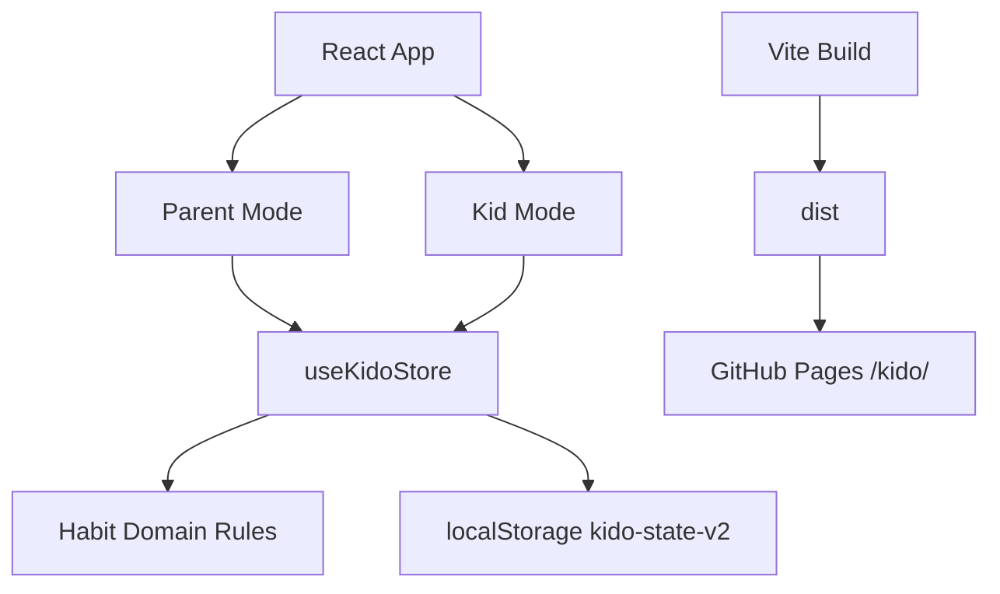

# KIDO Technical Architecture v0.1

**Current implementation:** v0.1.1 Core Stabilization  
**Product:** KIDO — *Small habits. Big kids.*  
**Audience:** parent buyer and child user, initially ages 6–12  
**Product loop:** Habits → Practice → Progress → Independence → Graduation

## 1. Architecture goals

- Deliver a mobile-first web experience installable as a Progressive Web App.
- Keep Parent and Kid experiences distinct on a shared family device.
- Make the core habit loop behave realistically before introducing a backend.
- Keep prototype family data local to the current browser.
- Make the graduation lifecycle a domain rule, not a decorative archive action.
- Keep future account sync, multiple caregivers, notifications, billing, and analytics outside this local prototype.

## 2. Stack

| Area | Choice | Responsibility |
| --- | --- | --- |
| UI | React 19 | Screen composition and interaction |
| Build | Vite 6 | Local dev and static production bundle |
| Language | JavaScript modules + JSX | Low setup cost |
| Styling | CSS custom properties + component classes | KIDO design system and responsive modes |
| Persistence | `localStorage` | Single-device prototype state, key `kido-state-v2` |
| Domain rules | `src/domain/habits.js` | Scheduling, streaks, weekly progress, levels, graduation readiness |
| PWA | Manifest + service worker | Installation metadata and same-origin caching |
| Hosting | GitHub Pages | Static deployment under `/kido/` |
| Validation | Node test runner + GitHub Actions | Domain tests and production build checks |

## 3. Runtime shape



## 4. Core domain model

```js
{
  setupComplete: Boolean,
  parentPin: String,
  child: {
    name: String,
    age: Number,
    avatar: String
  },
  goals: String[],
  habits: [{
    id: String,
    title: String,
    emoji: String,
    time: 'Morning' | 'Afternoon' | 'Evening' | 'Anytime',
    goal: String,
    days: Number[],
    xpValue: 5 | 10 | 20,
    approvalRequired: Boolean,
    startedAt: 'YYYY-MM-DD',
    pendingDate: 'YYYY-MM-DD' | null,
    doneDates: String[],
    graduated: Boolean,
    graduatedAt: 'YYYY-MM-DD' | null
  }],
  xp: Number
}
```

Derived values such as current streak, weekly completion, level, and habit stage are calculated from source data rather than stored independently.

## 5. Daily completion and approval

A scheduled habit is shown only on its configured weekdays and only after its start date.

When a child taps **I did it**:

- A self-check habit is completed immediately and awards its configured XP.
- A parent-check habit receives a `pendingDate` and waits for approval.
- Approval adds that date to `doneDates`, clears the pending state, and awards XP once.
- “Not yet” clears the pending state without penalty.

The daily goal is achieved at **80% completion** of that day's scheduled habits.

## 6. Streak rule

The current streak is derived from consecutive scheduled days that met the 80% daily goal.

If today is not complete yet, KIDO preserves the streak earned through yesterday instead of displaying zero first thing in the morning. Days with no scheduled habits are skipped rather than breaking a streak.

## 7. XP and levels

Starter and custom habits award 5, 10, or 20 XP depending on effort. Graduation awards 100 XP.

Levels are derived in 200 XP steps. Level state is not stored separately.

## 8. Habit lifecycle

```text
LEARNING
  ↓ after 8 scheduled opportunities
BUILDING
  ↓ after 21+ opportunities and ≥80% completion
CONSISTENT
  ↓ after 30 opportunities and ≥85% across latest 30
READY TO GRADUATE
  ↓ parent confirms real-world independence
GRADUATED
```

KIDO never auto-graduates a habit. The final decision remains with the parent.

## 9. Parent protection

Returning from Kid Mode to Parent Mode requires a 4-digit Parent PIN.

In v0.1.1 this PIN is stored locally in the browser and is only a casual access boundary. It is not encryption or production authentication.

A production cloud version must replace this with a server-backed parent session and appropriate recovery controls.

## 10. PWA and GitHub Pages

The production Vite base is `/kido/`.

The manifest uses relative `start_url`, `scope`, and icon references. The service worker derives its base path from its registration scope so offline navigation works under the project subdirectory.

GitHub Actions:

1. runs `npm install`,
2. runs domain tests,
3. builds the Vite bundle,
4. deploys `dist/` to GitHub Pages on pushes to `main`.

## 11. Boundaries before cloud MVP

Not implemented in v0.1.1:

- Parent authentication.
- Server-side family storage.
- Cross-device sync.
- Multiple caregivers.
- Account recovery.
- Data export/deletion.
- Push notifications.
- Reward/coin economy.
- Subscription and billing.
- AI recommendations.
- Native mobile apps.

These should be addressed in KIDO v0.2 Cloud MVP after the local habit loop is validated.

## 12. Quality gates

- `npm install` must resolve dependencies successfully.\n- `npm test` must pass all habit-domain tests.
- `npm run build` must produce a Vite production bundle.
- Every onboarding goal must produce at least one starter habit.
- Weekday schedules must not appear on unscheduled days.
- Self-check habits must complete without parent approval.
- Parent-check habits must wait for approval.
- Kid → Parent mode must require the Parent PIN.
- Graduation must be unavailable before the readiness rule is met.
- GitHub Pages assets and PWA files must resolve under `/kido/`.
